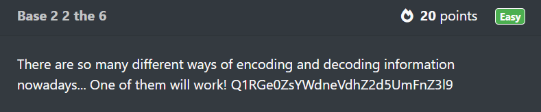
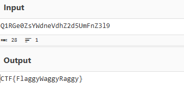
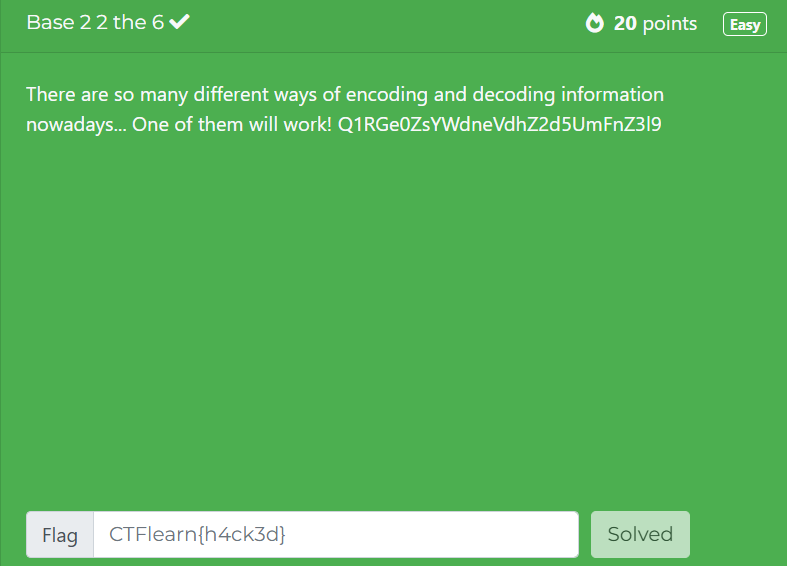

# Base 2 2 the 6
In this post, we will be attempting to solve the **Base 2 2 the 6** challenge from the Easy Difficulty on CTFLearn.

You can access the challenge here: <a href="https://ctflearn.com/challenge/192">Base 2 2 the 6</a>

Let us look at the problem:

We can see that this is another encoding problem.

The challenge mentions that there are multiple ways of encoding and decoding and the title of the challenge is another clue.

2 2 the 6 can be read as **2 to the 6 or 2⁶** which is 64.

This gives the method of encoding namely **Base64**.

## Base64
* Base64 is a binary-to-text encoding scheme that transforms binary data into ASCII characters or vice-versa.

* Standard Base64 alphabet consists of:
  1. 26 uppercase letters
  2. 26 lowercase letters
  3. 10 digits
  4. 2 characters (+ and /)

* Uses:
  1. Embedding binary files in HTML.
  2. Storing complex data in cookies.

## Solution
* The tool we will be using to convert this code from Base64 to ASCII is <a href="https://gchq.github.io/CyberChef/">CyberChef</a>.

 
* The flag for this challenge is: **CTF{FlaggyWaggyRaggy}**

