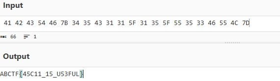

# Character Encoding

In this post, we will be attempting to solve the **Character Encoding** challenge from the Easy Difficulty on CTFLearn.

You can access the challenge <a href="https://ctflearn.com/challenge/115">here</a>.

Let us look at the problem:

Looking at these numbers, you can see that they are in the **hexadecimal format**.

## Hexadecimal Numbers
So what are hexadecimal numbers?

Hexadecimal numbers are a base-16 numbering system which consist of digits from **0 to 9** and letters **A through F**.

Here A represents decimal 10, B represents 11, C represents 12, D represents 13, E represents 14 and F represents 15.

Example of hexadecimal number: 7B3

Number in decimal form: 7 x 16² + 11 x 16¹ + 3 x 16⁰ = 1971

Uses of Hexadecimal numbers:
* **Color codes**: Hexadecimal numbers are used to represent color codes in HTML and CSS. Each color is represented as 6 digits, with the first 2 represent red, next 2 represent green, and last 2 blue.
* **MAC Address**: MAC Addresses which uniquely identify network devices are expressed as 12 hexadecimal digits.

## Solution
Now, to make sense of these digits, we have to convert the given hexadecimal numbers into ASCII format.

ASCII is a standardized text format used all over the world.

It is a 7-bit representing 128 characters, consisting of numbers , lowercase and uppercase letters and symbols.

To convert hexadecimal to ASCII, we will be using a free, open-source tool called <a href="https://medium.com/r/?url=https%3A%2F%2Fgchq.github.io%2FCyberChef%2F">CyberChef</a> which helps with data manipulation and analysis.

Uploading the hexadecimal code gives us the following output:

The flag for this challenge is **ABCTF{45C11_15_U53FUL}**.

