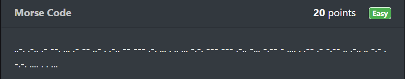
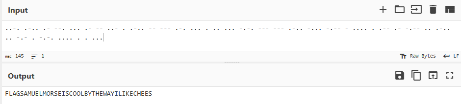
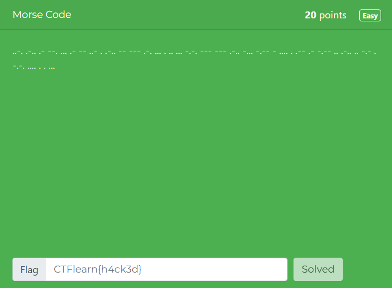

# Morse Code

In this post, we will be attempting to solve the **Morse Code** challenge from the Easy Difficulty on CTFLearn.

You can access the challenge here: <a href="https://ctflearn.com/challenge/309">Morse Code</a>

Let us look at the problem:

As you can see, the code given to us is in the Morse Code format.

## Morse Code
* Morse Code is a method of encoding text information as a series of on-off tones, clicks, or light flashes that can be used for communication over a telegraph or other communication device.
* The code uses two types of signals: **dots** (short signals) and **dashes** (long signals), often referred to as **dits** and **dahs** respectively. 
* Each letter, number, and some punctuation marks are represented by a unique sequence of these signals.

## Solution
* The tool we will be using to convert this code from Base64 to ASCII is <a href="https://gchq.github.io/CyberChef/">CyberChef</a>.

* The flag for this challenge is: **FLAGSAMUELMORSEISCOOLBYTHEWAYILIKECHEES**

