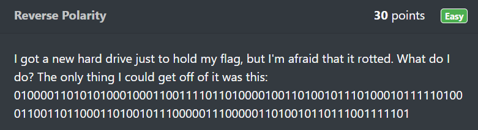
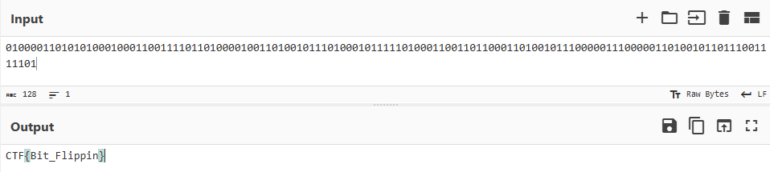
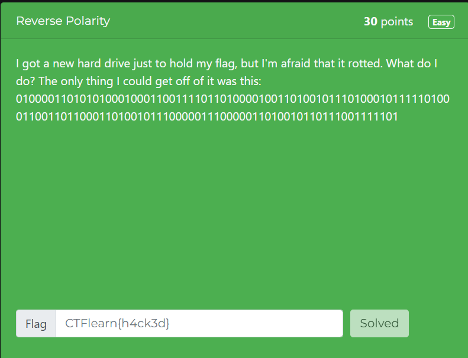

# Reverse Polarity

In this post, we will be attempting to solve the **Reverse Polarity** challenge from the Easy Difficulty on CTFLearn.

You can access the challenge here: <a href="https://ctflearn.com/challenge/230">Reverse Polarity</a>

Let us look at the problem:

As you can see, the above code is the binary format.

## Binary
* Binary is a numerical system that uses only 2 digits: **0 and 1**.
* It is known as a base-2 system because it relies on these two digits to represent all data.
* Binary is the foundation of computing, as it allows computers to process and store information efficiently by using electrical signals that are either on (1) or off (0).

## Solution
* The tool we will be using to convert this code from Base64 to ASCII is <a href="https://gchq.github.io/CyberChef/">CyberChef</a>.

* The flag for this challenge is: **CTF{Bit_Flippin}**

