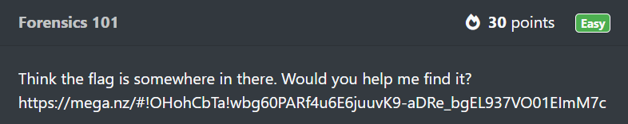
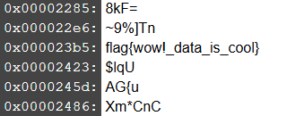
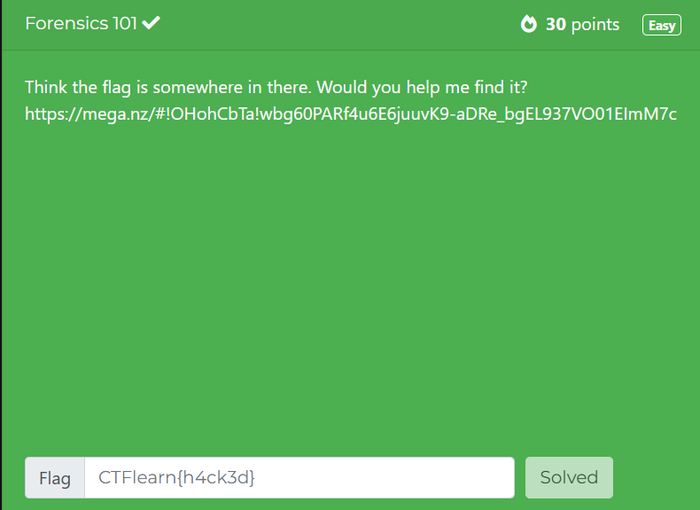

# Forensics 101
In this post, we will be attempting to solve the **Forensics 101** challenge from the Easy Difficulty on CTFLearn.

You can access the challenge here: <a href="https://ctflearn.com/challenge/96">Forensics 101</a>

Let us look at the problem:

Navigating to the site, gives us a photo which you can download:

At a first glance, there is nothing in this image, which looks like a flag. 

Looking at the challenge gives us a clue, that we have to perform some kind of **forensics** on the image.

The website I recommend is: <a href="https://www.fotoforensics.com/">FotoForensics</a>

FotoForensics is an online tool designed for analyzing digital images to determine their authenticity and detect possible manipulation.

It performs various test such as Error Level Analysis, Metadata Analysis and finding hidden files.

Let's upload our image and check each type of test.

We can find the flag in the **String** Analysis option at the end of the list:

The flag for this challenge is: **flag{wow!_data_is_cool}**

