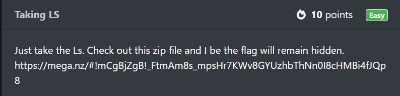
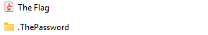
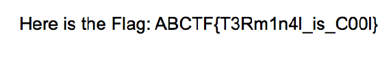
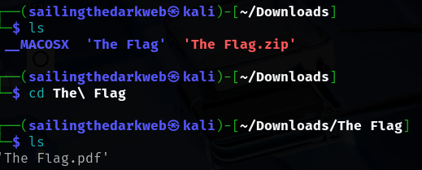
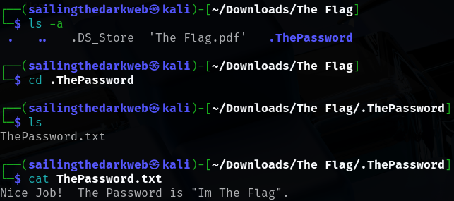
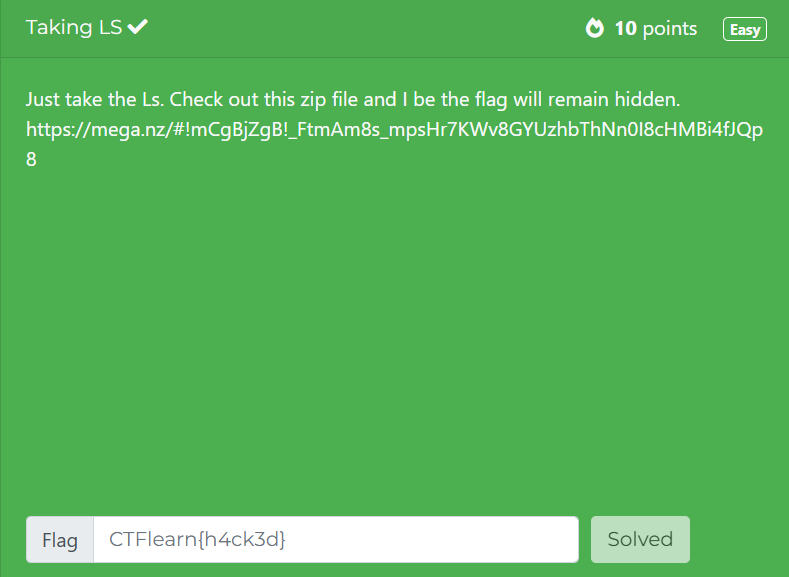

# Taking LS
In this post, we will be attempting to solve the **Taking LS** challenge from the Easy Difficulty on CTFLearn.

You can access the challenge here: <a href="https://ctflearn.com/challenge/103">Taking LS</a>

Let us look at the problem:

Navigating to the website gives us a ZIP file which we download and unzip.

## Method 1
1. When we look at the files inside we can see two documents:

2. The **.ThePassword** folder contains the password to unlock the The Flag document: **Im The Flag**.
3. Entering this password gives us the flag for this challenge:

The flag for this challenge is: **ABCTF{T3Rm1n4l_is_C00l}**

## Method 2
1. Looking at the description of the challenge gives us a clue.
2. **Ls** is a command in Linux which display all the files that are available in the directory.

3. As you can see, we can only see the PDF file but not the password file.
4. To find the password, we have to use the **"-a"** option with ls to display all hidden files.

5. After finding the hidden directory and navigating to it, we find the **ThePassword.txt** file.
6. Now we use the command **"cat"** which represents concatenate to read the contents of the file.
7. Using that password on the PDF file gives us the flag.
8. The flag is: **ABCTF{T3Rm1n4l_is_C00l}**

