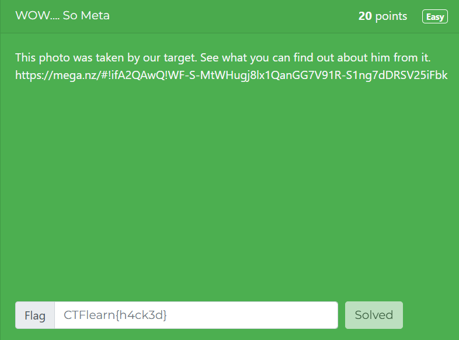

# WOW.... So Meta

* In this post, we will be attempting to solve the WOW… So Meta challenge from the Easy Difficulty on CTFLearn.
* You can access the challenge here: <a href="https://ctflearn.com/challenge/348">WOW… So Meta</a>
* Let us look at the problem:

* Navigating to the site, gives us a photo which you can download:
 

* At a first glance, there is nothing in this image, which looks like a flag.
* The name of the challenge gives us a clue, that we have to read the metadata of the image.

## Metadata
* Metadata is defined as "data about data," providing structured information that describes, explains, or summarizes other data without being part of the content itself.
* It contains information such as:-
  1. Who created the data
  2. When the data was created
  3. The size of the digital file
* We will analyze the metadata of this image and try to find the flag.

## Solution
* The website we will be using to analyze the metadata is: <a href="https://www.metadata2go.com/">Metadata2go</a>.
* Upload the image and start the analysis.
* Scroll down to the **camera_serial_number** field and you will find the flag.

* The flag for this challenge is **flag{EEe_x_I_FFf}**

