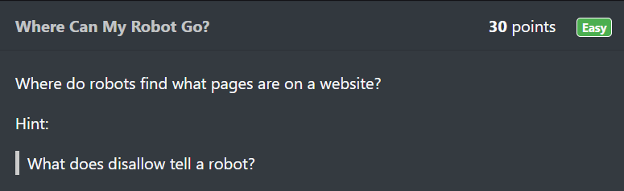
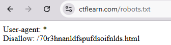
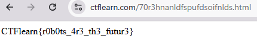
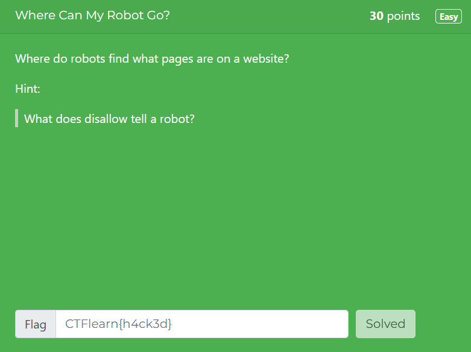

# Where Can My Robot Go?

In this post, we will be attempting to solve the **Where Can My Robot Go?** challenge from the Easy Difficulty on CTFLearn.

You can access the challenge here: <a href="https://ctflearn.com/challenge/107">Where Can My Robot Go?</a>

Let us look at the problem:

Looking at the question, we see that it refers to a robot in website.

A quick Google search tells us that, **robots** are automated programs that search websites.

## Solution
* Let us navigate to **ctflearn.com/robots.txt**

* The Disallow link here is a page that the robots program is not allowed to access.
* Let us navigate to **ctflearn.com/70r3hnanldfspufdsoifnlds.html**

* The flag for this challenge is: **CTFlearn{r0b0ts_4r3_th3_futur3}**

