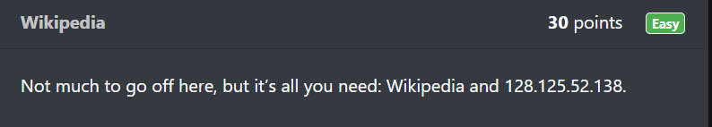
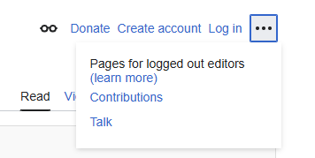
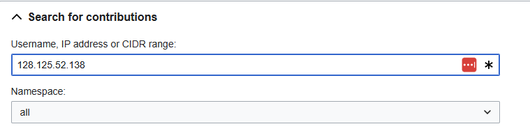
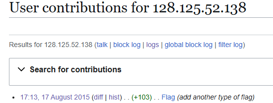
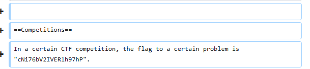
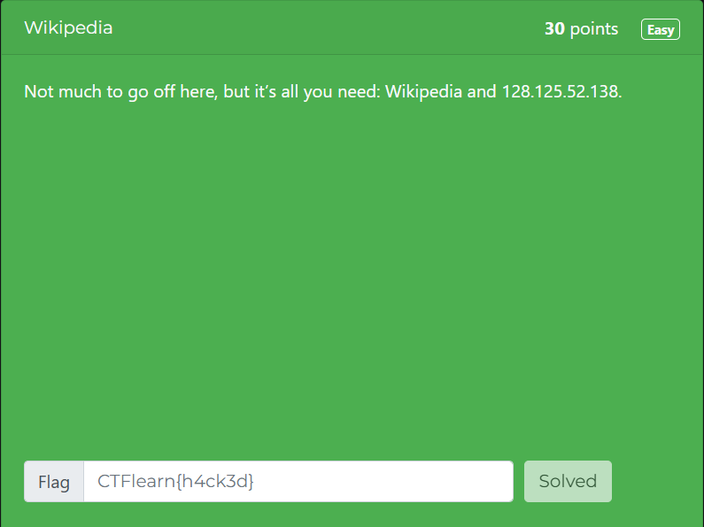

# Wikipedia

In this post, we will be attempting to solve the **Wikipedia** challenge from the Easy Difficulty on CTFLearn.

You can access the challenge here: <a href="https://ctflearn.com/challenge/168">Wikipedia</a>

Let us look at the problem:

This challenge only gives us two clues: **Wikipedia** and an **IP address** (128.125.52.138).

## Wikipedia
* Wikipedia is a free, online, multilingual encyclopedia that is collaboratively edited by a community of volunteers from around the world.
* Since anybody can contribute to this encyclopedia, Wikipedia allows us to look at contributions made based on the IP address of the device.

## Solution
* We will checking the contributions made by the device with the given IP address (128.125.52.138).
* Navigate to the <a href="https://en.wikipedia.org/wiki/Main_Page">Main Page</a> of Wikipedia.
* Click on the three dots at the top right corner and choose Contributions

* In the **Search for Contributions** section, enter the IP address and click search.

* We see that an entry has been made for **Flag** page on 17th August 2015.
* Choose the **diff** option to look at the different versions.

* In the **diff**, we can the two different versions and the flag available.

* The flag for this challenge is: **cNi76bV2IVERlh97hP**.

