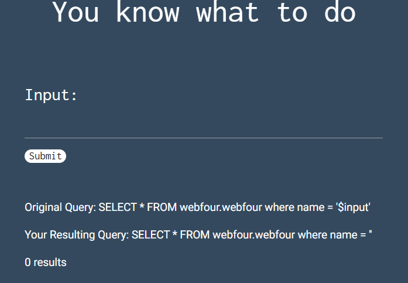
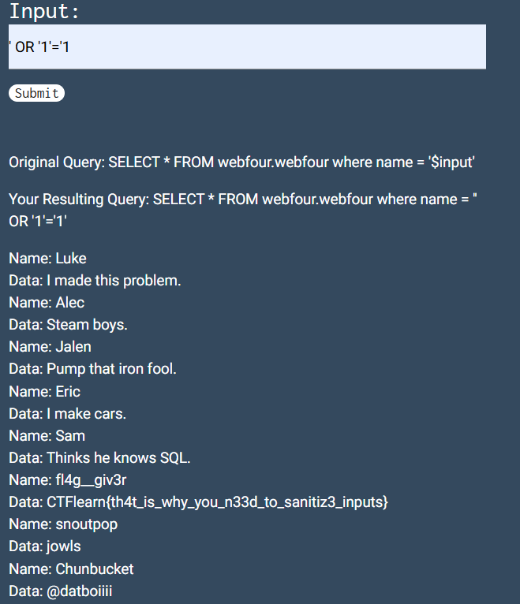
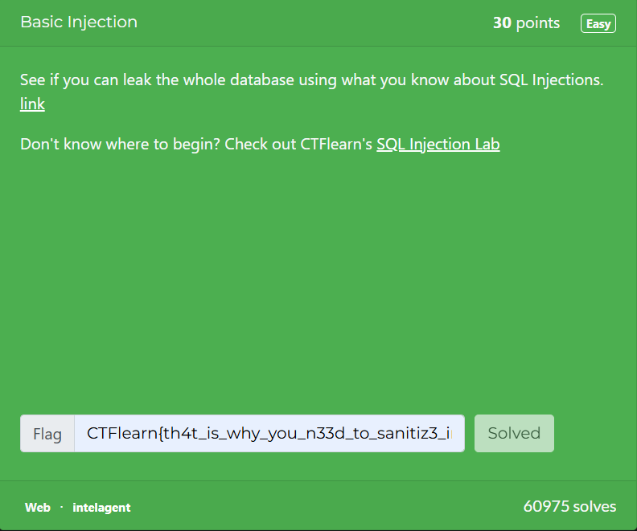

# Basic Injection
In this post, we will be attempting to solve the **Basic Injection** challenge from the Easy Difficulty on CTFLearn.

You can access the challenge here: <a href="https://medium.com/r/?url=https%3A%2F%2Fctflearn.com%2Fchallenge%2F88">Basic Injection</a>

Let us look at the problem:

We are asked to leak the whole database using SQL Injection.

## SQL Injection
What is SQL Injection?

SQL injection is a code injection technique used to attack data-driven applications by inserting malicious SQL statements into input fields.

This vulnerability arises when user-supplied data is not properly validated or sanitized before being incorporated into SQL queries.

Let us look at an example command:
`select * from person where name = 'susan'`

This command gives us all the information from the **person** database where the name of the person is **susan**.

SQL takes the input susan and check with all the entries and gives us the conditions which match.

So, if we enter: `select * from person where name = 'OR '1'='1`

It will give us all the values because the condition 1 = 1 is always true.

Attackers use these type of commands to steal information from databases.

## Solution
* Now, let us try to leak the database.

* Enter ' OR '1'='1 into the input box provided for us:

* As you can see, the flag for this challenge is **CTFlearn{th4t_is_why_you_n33d_to_sanitiz3_inputs}**

